# Vault Markets — On-Chain Requirements Specification

> **Version**: 1.0 (Draft)
> **Target Network**: Arbitrum One
> **Collateral**: USDC
> **Last Updated**: February 2026

This document specifies the requirements for migrating Vault Markets from an off-chain prediction market platform to a fully on-chain, decentralized system on Arbitrum.

---

## Table of Contents

1. [Executive Summary](#1-executive-summary)
2. [System Context & Architecture](#2-system-context--architecture)
3. [Old vs New System Comparison](#3-old-vs-new-system-comparison)
4. [Smart Contract Requirements](#4-smart-contract-requirements)
5. [Multi-Outcome CPMM Specification](#5-multi-outcome-cpmm-specification)
6. [Hybrid Trading (AMM + Signed Orders)](#6-hybrid-trading-amm--signed-orders)
7. [Creator & Graduation System](#7-creator--graduation-system)
8. [Liquidity Vault System](#8-liquidity-vault-system)
9. [Resolution & Oracle Requirements](#9-resolution--oracle-requirements)
10. [Indexing & Data Infrastructure](#10-indexing--data-infrastructure)
11. [Admin Workflow Adaptation](#11-admin-workflow-adaptation)
12. [Security Requirements](#12-security-requirements)
13. [Migration Plan](#13-migration-plan)

---

## 1. Executive Summary

### Goals

- **Move core trading + settlement to smart contracts** — custody, positions, and redemption happen entirely on-chain
- **Preserve existing product workflows** — trading UX, market lifecycle, admin mechanics remain familiar
- **Add Polymarket/Kalshi-like hybrid trading** — CPMM AMM + off-chain signed limit orders settled on-chain
- **Support multi-outcome markets** — N ≥ 2 outcomes (binary as minimum/default)
- **Enable permissionless market creation** — pump.fun-style graduation system with fee splits
- **Achieve complete decentralization** — any off-chain component must be non-custodial and replaceable

### Key Design Decisions

| Decision | Choice |
|----------|--------|
| **Collateral** | USDC on Arbitrum |
| **Outcome shares** | ERC-1155 (fungible tokenIds; tokenId = outcomeIndex) |
| **Order book model** | Off-chain EIP-712 signed orders + on-chain settlement |
| **Positions** | Fungible (no ERC-721 position NFTs) |
| **Contract architecture** | Upgradeable (UUPS proxy pattern) |
| **Resolution** | Optimistic oracle + Chainlink data feeds |

---

## 2. System Context & Architecture

### 2.1 End-to-End System Context

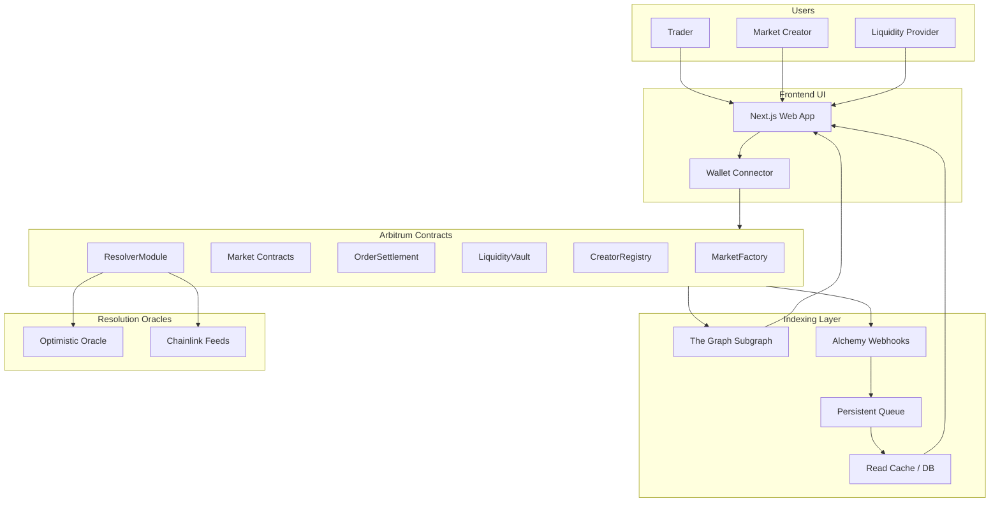

### 2.2 Smart Contract Architecture

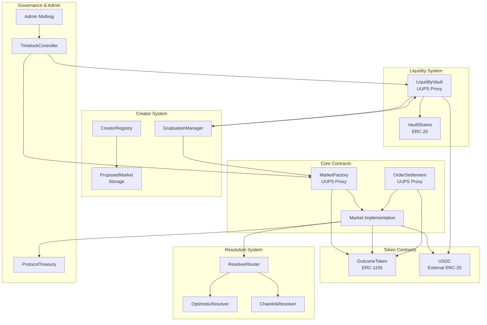

---

## 3. Old vs New System Comparison

### 3.1 User Flow Differences

| Flow | Old System (Off-Chain) | New System (On-Chain) |
|------|------------------------|----------------------|
| **Authentication** | Privy JWT (X/Twitter OAuth) | Wallet signature (EIP-4361 SIWE) + optional social linking |
| **Account creation** | Auto-provisioned on first login, $10k virtual balance | Wallet address is identity; deposit USDC to trade |
| **View balances** | Database query via `/api/me` | On-chain USDC balance + ERC-1155 outcome token balances |
| **Place market order** | API call → DB transaction → balance update | Wallet tx → contract call → USDC transfer + token mint |
| **Place limit order** | N/A (not supported) | Sign EIP-712 message → relay → on-chain settlement |
| **Cancel order** | N/A | On-chain nonce increment or explicit cancel tx |
| **View positions** | Database query via `/api/position/[marketId]` | Subgraph query or direct ERC-1155 `balanceOf` |
| **Sell shares** | API call → DB transaction | Wallet tx → burn tokens → receive USDC |
| **Redeem winnings** | API call to `/api/me/redeem` | Wallet tx → burn winning tokens → receive USDC |
| **View price history** | `PriceSnapshot` table via API | Subgraph time-series data from contract events |

### 3.2 Admin Flow Differences

| Flow | Old System (Off-Chain) | New System (On-Chain) |
|------|------------------------|----------------------|
| **Create market** | Admin UI → API → database insert | Admin UI → multisig tx → Factory.createMarket() |
| **Publish/unpublish** | Toggle `isPublished` flag in DB | On-chain `isListed` flag or frontend-only listing policy |
| **Close market** | API sets status to CLOSED | Time-based auto-close or governance emergency close tx |
| **Resolve market** | Admin selects winning outcome via API | Oracle proposes → dispute window → finalize on-chain |
| **Settle payouts** | Admin triggers batch DB updates | Automatic: users call `redeem()` permissionlessly |
| **Adjust user balance** | Admin API with ledger entry | N/A (no off-chain balances); can airdrop USDC if needed |
| **Review market requests** | Admin UI → approve/reject in DB | Admin UI → approve → graduation process or direct creation |

### 3.3 Money/Token Flow Differences

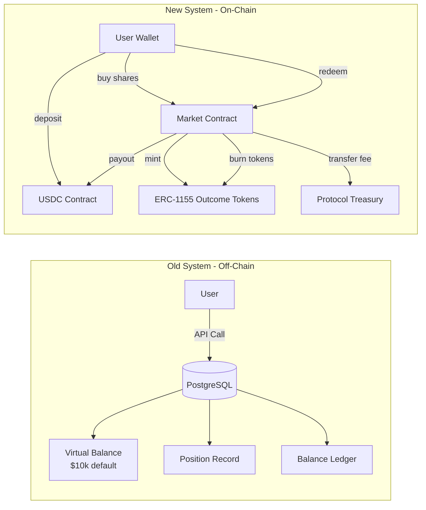

| Aspect | Old System | New System |
|--------|------------|------------|
| **Collateral custody** | Platform-controlled database | User-controlled (USDC in wallet or contract) |
| **Position representation** | Database `Position` record | ERC-1155 tokens (transferable, composable) |
| **Fee collection** | Implicit in pricing math | Explicit on-chain transfer to treasury |
| **Fee split** | Single protocol fee | Creator fee + protocol fee (configurable bps) |
| **Liquidity provision** | Admin-seeded pools | LiquidityVault deposits + permissionless LP |
| **Settlement** | Batch DB update by admin | Permissionless individual redemption |
| **Audit trail** | `BalanceLedger`, `PnLLedger` tables | On-chain events (Transfer, Trade, Redemption) |

### 3.4 Trust Assumption Differences

| Trust Assumption | Old System | New System |
|------------------|------------|------------|
| **Balance integrity** | Trust platform DB | Trustless (smart contract enforced) |
| **Trade execution** | Trust platform API | Trustless (AMM invariant enforced) |
| **Market resolution** | Trust admin | Trust oracle (with dispute mechanism) |
| **Redemption** | Trust platform to pay out | Trustless (contract holds USDC) |
| **Upgrade authority** | Full control by devs | Timelocked multisig with transparency |
| **Market listing** | Platform discretion | Governance-controlled or permissionless |

---

## 4. Smart Contract Requirements

### 4.1 MarketFactory

**Purpose**: Deploy and initialize new markets; central registry for all markets.

**State**:
```solidity
struct MarketParams {
    bytes32 metadataCID;        // IPFS/Arweave CID for off-chain metadata
    uint8 outcomeCount;         // N >= 2
    string[] outcomeLabels;     // Human-readable labels
    uint256 closesAt;           // Trading end timestamp
    address resolverModule;     // Oracle/resolver contract
    bytes32 resolutionKey;      // Identifier for resolution data
    uint16 feeBps;              // Total fee in basis points
    uint16 creatorFeeBps;       // Creator's share of fee
    address creator;            // Market creator address
}

mapping(bytes32 => address) public markets;      // marketId => Market address
mapping(address => bool) public isMarket;        // Quick lookup
uint256 public marketCount;
```

**Functions**:
```solidity
function createMarket(MarketParams calldata params) external returns (address market);
function createMarketDeterministic(MarketParams calldata params, bytes32 salt) external returns (address);
function getMarket(bytes32 marketId) external view returns (address);
function pause() external;     // Emergency pause (governance only)
function unpause() external;
```

**Events**:
```solidity
event MarketCreated(
    bytes32 indexed marketId,
    address indexed market,
    address indexed creator,
    uint8 outcomeCount,
    uint256 closesAt
);
event MarketGraduated(bytes32 indexed marketId, address indexed market);
```

### 4.2 Market Contract

**Purpose**: Individual prediction market with multi-outcome CPMM trading.

**State Machine**:

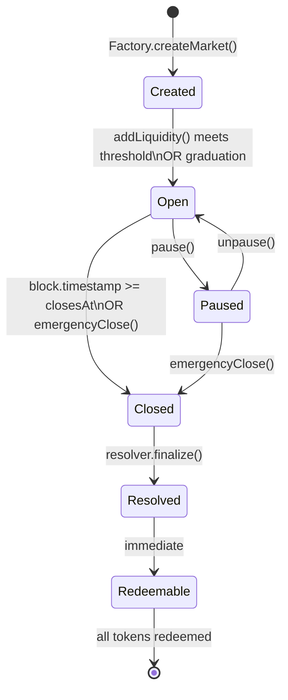

**State**:
```solidity
enum MarketStatus { Created, Open, Closed, Resolved, Paused }

struct MarketState {
    MarketStatus status;
    uint8 outcomeCount;
    uint8 resolvedOutcome;      // 0xFF = unresolved
    uint256 closesAt;
    uint256 resolvedAt;
    uint16 feeBps;
    uint16 creatorFeeBps;
    address creator;
    address resolverModule;
    bytes32 resolutionKey;
}

// CPMM state per outcome
uint256[] public reserves;      // reserves[outcomeIndex]
uint256 public k;               // Constant product invariant
uint256 public totalLiquidity;  // Total USDC deposited as liquidity

// Token tracking
address public outcomeToken;    // ERC-1155 contract
uint256 public baseTokenId;     // Base ID for this market's outcomes
```

**Core Functions**:
```solidity
// Trading
function buy(uint8 outcomeIndex, uint256 usdcAmount, uint256 minShares) external returns (uint256 shares);
function sell(uint8 outcomeIndex, uint256 shares, uint256 minUsdc) external returns (uint256 usdcAmount);
function getQuote(uint8 outcomeIndex, uint256 amount, bool isBuy) external view returns (uint256);
function getPrices() external view returns (uint256[] memory prices);

// Liquidity
function addLiquidity(uint256 usdcAmount) external returns (uint256 liquidityShares);
function removeLiquidity(uint256 liquidityShares) external returns (uint256 usdcAmount);

// Settlement
function resolve(uint8 winningOutcome) external;  // Called by resolver only
function redeem(uint8 outcomeIndex) external returns (uint256 payout);
function redeemAll() external returns (uint256 totalPayout);

// Admin (governance controlled)
function pause() external;
function unpause() external;
function emergencyClose() external;
```

**Events**:
```solidity
event Trade(
    address indexed trader,
    uint8 indexed outcomeIndex,
    bool isBuy,
    uint256 usdcAmount,
    uint256 shares,
    uint256 avgPrice,
    uint256[] newPrices
);
event LiquidityAdded(address indexed provider, uint256 usdcAmount, uint256 liquidityShares);
event LiquidityRemoved(address indexed provider, uint256 usdcAmount, uint256 liquidityShares);
event MarketResolved(uint8 indexed winningOutcome, uint256 timestamp);
event Redemption(address indexed redeemer, uint8 outcomeIndex, uint256 shares, uint256 payout);
event StatusChanged(MarketStatus indexed oldStatus, MarketStatus indexed newStatus);
```

### 4.3 OutcomeToken (ERC-1155)

**Purpose**: Represent outcome shares as fungible tokens.

**Token ID Schema**:
```
tokenId = (marketId << 8) | outcomeIndex
```
- Upper bits: market identifier
- Lower 8 bits: outcome index (0 to N-1)

**Extensions**:
- `ERC1155Supply` for total supply tracking
- `ERC1155Burnable` for redemption
- Access control: only Market contracts can mint/burn

### 4.4 OrderSettlement Contract

**Purpose**: Settle off-chain signed limit orders on-chain.

See [Section 6](#6-hybrid-trading-amm--signed-orders) for detailed specification.

### 4.5 Fee & Treasury

**Fee Structure**:
```solidity
// Per-market configuration
uint16 totalFeeBps;      // e.g., 100 = 1%
uint16 creatorFeeBps;    // e.g., 30 = 0.3% to creator
// Protocol receives: totalFeeBps - creatorFeeBps

// Fee distribution on each trade
uint256 totalFee = (usdcAmount * totalFeeBps) / 10000;
uint256 creatorFee = (usdcAmount * creatorFeeBps) / 10000;
uint256 protocolFee = totalFee - creatorFee;
```

**Treasury Contract**:
- Receives protocol fees from all markets
- Governed by timelock + multisig
- Supports withdrawal to designated recipients

---

## 5. Multi-Outcome CPMM Specification

### 5.1 Mathematical Model

The market uses a **Fixed Product Market Maker (FPMM)** adapted for prediction markets with N outcomes.

**Invariant**:
```
k = ∏(reserves[i]) for i in 0..N-1
```

For binary markets (N=2): `k = reserve0 × reserve1`

**Price Calculation**:
```
price[i] = (∏(reserves[j]) for j ≠ i) / (∑(∏(reserves[j]) for j ≠ k) for all k)
```

For binary: `price0 = reserve1 / (reserve0 + reserve1)`

**Buy Operation** (Complete Sets Model):
1. User deposits `X` USDC
2. Mint `X` complete sets (one share of each outcome)
3. Return shares of desired outcome to restore invariant
4. User receives excess shares of chosen outcome

**Sell Operation**:
1. User deposits shares of one outcome
2. Burn complete sets to restore invariant
3. Return USDC equivalent to burned complete sets

### 5.2 Precision & Rounding

| Value | Decimals | Notes |
|-------|----------|-------|
| USDC | 6 | Native USDC decimals |
| Shares | 18 | Internal precision |
| Prices | 18 | Represented as fixed-point |
| Reserves | 18 | Internal accounting |

**Rounding Rules**:
- Buy: round shares down (favor protocol)
- Sell: round USDC down (favor protocol)
- Always maintain `k ≥ originalK`

### 5.3 Trade Flow Diagram

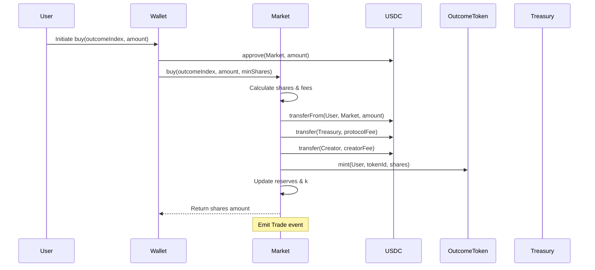

---

## 6. Hybrid Trading (AMM + Signed Orders)

### 6.1 Order Types

| Type | Execution | Use Case |
|------|-----------|----------|
| **Market Order** | Immediate against AMM | Quick trades, accepts slippage |
| **Limit Order** | Signed message, settled when matched | Price-specific entries |
| **Fill-or-Kill** | Must fully fill or revert | Precise position sizing |

### 6.2 EIP-712 Order Format

```solidity
struct Order {
    address maker;              // Order creator
    bytes32 marketId;           // Target market
    uint8 outcomeIndex;         // Which outcome
    bool isBuy;                 // true = buy shares, false = sell
    uint256 amount;             // USDC for buy, shares for sell
    uint256 price;              // Limit price (18 decimals)
    uint256 minFillAmount;      // Minimum fill to accept
    uint256 expiry;             // Order expiration timestamp
    uint256 nonce;              // Replay protection
    bytes32 salt;               // Additional uniqueness
}

// EIP-712 Domain
bytes32 constant DOMAIN_TYPEHASH = keccak256(
    "EIP712Domain(string name,string version,uint256 chainId,address verifyingContract)"
);

bytes32 constant ORDER_TYPEHASH = keccak256(
    "Order(address maker,bytes32 marketId,uint8 outcomeIndex,bool isBuy,uint256 amount,uint256 price,uint256 minFillAmount,uint256 expiry,uint256 nonce,bytes32 salt)"
);
```

### 6.3 Order Settlement Contract

```solidity
interface IOrderSettlement {
    // Fill a signed order
    function fillOrder(
        Order calldata order,
        bytes calldata signature,
        uint256 fillAmount
    ) external returns (uint256 filledAmount);

    // Fill multiple orders atomically
    function batchFillOrders(
        Order[] calldata orders,
        bytes[] calldata signatures,
        uint256[] calldata fillAmounts
    ) external returns (uint256[] memory filledAmounts);

    // Cancel order by incrementing nonce
    function incrementNonce() external;

    // Cancel specific order
    function cancelOrder(Order calldata order) external;

    // View functions
    function getOrderHash(Order calldata order) external view returns (bytes32);
    function getOrderStatus(bytes32 orderHash) external view returns (uint256 filled, bool cancelled);
    function getNonce(address maker) external view returns (uint256);
}
```

### 6.4 Limit Order Flow

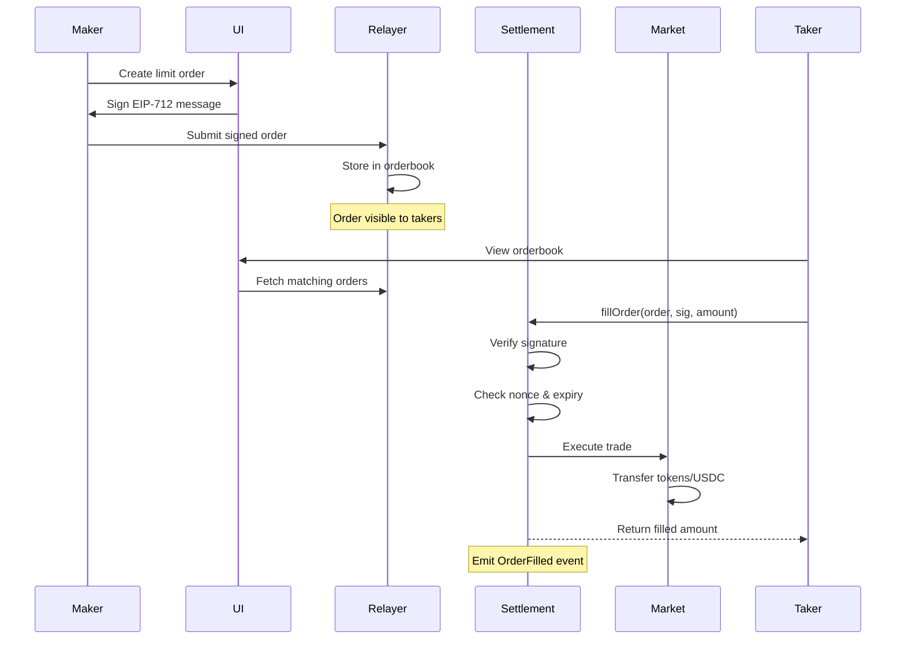

### 6.5 Order Matching Rules

1. **Price priority**: Better prices fill first
2. **Time priority**: Earlier orders at same price fill first
3. **Partial fills**: Allowed if `fillAmount >= order.minFillAmount`
4. **Expiry**: Orders rejected after `block.timestamp > expiry`
5. **Nonce**: Orders rejected if `order.nonce < maker.currentNonce`

### 6.6 MEV Protection

- **Slippage bounds**: Market orders specify `minShares` or `minUsdc`
- **Expiry**: Short expiry limits stale order exploitation
- **Private mempools**: Optional Flashbots Protect integration
- **Fill-or-Kill**: Prevents partial fill griefing

---

## 7. Creator & Graduation System

### 7.1 Overview

A "pump.fun-style" system where anyone can propose markets, and markets graduate to full trading status once liquidity thresholds are met.

### 7.2 Creator Registry

```solidity
interface ICreatorRegistry {
    struct Creator {
        address wallet;
        uint256 marketsCreated;
        uint256 totalVolume;
        uint256 totalFees;
        bool isVerified;        // Optional verification tier
        uint256 bondAmount;     // Staked bond
    }

    function register() external payable;  // Optional bond
    function proposeMarket(MarketProposal calldata proposal) external returns (bytes32 proposalId);
    function withdrawFees(bytes32[] calldata marketIds) external;
    function getCreator(address wallet) external view returns (Creator memory);
}
```

### 7.3 Market Proposal & Graduation

```solidity
struct MarketProposal {
    bytes32 metadataCID;
    uint8 outcomeCount;
    string[] outcomeLabels;
    uint256 closesAt;
    address resolverModule;
    bytes32 resolutionKey;
    uint256 graduationThreshold;  // Min USDC to graduate
}

enum ProposalStatus { Pending, Graduated, Rejected, Expired }
```

**Graduation Flow**:

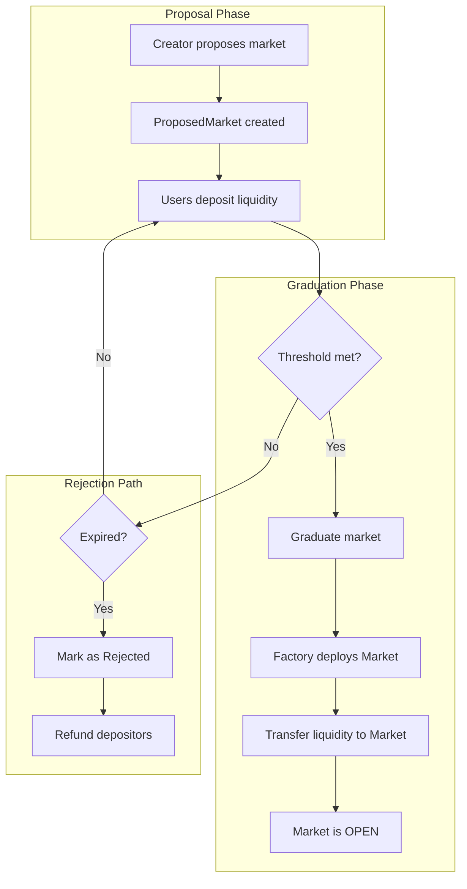

### 7.4 Fee Split Accounting

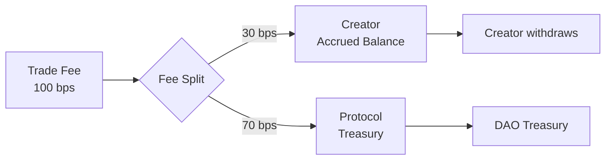

**Implementation**:
```solidity
// In Market contract
function _distributeFee(uint256 totalFee) internal {
    uint256 creatorFee = (totalFee * creatorFeeBps) / totalFeeBps;
    uint256 protocolFee = totalFee - creatorFee;

    creatorFeeAccrued[creator] += creatorFee;
    USDC.transfer(treasury, protocolFee);

    emit FeeDistributed(creator, creatorFee, protocolFee);
}
```

---

## 8. Liquidity Vault System

### 8.1 Purpose

A protocol-level USDC vault that:
- Accepts deposits from LPs
- Allocates seed liquidity to graduating markets
- Earns fees from seeded markets
- Distributes returns to depositors

### 8.2 Vault Architecture

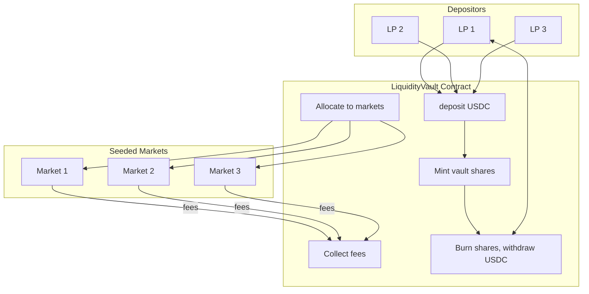

### 8.3 Vault Contract Interface

```solidity
interface ILiquidityVault {
    // Deposits
    function deposit(uint256 usdcAmount) external returns (uint256 shares);
    function withdraw(uint256 shares) external returns (uint256 usdcAmount);

    // Allocation (governance controlled)
    function allocateToMarket(bytes32 marketId, uint256 amount) external;
    function deallocateFromMarket(bytes32 marketId) external returns (uint256 recovered);

    // Fee collection
    function collectFees(bytes32[] calldata marketIds) external returns (uint256 totalFees);

    // View functions
    function totalAssets() external view returns (uint256);
    function sharePrice() external view returns (uint256);
    function getAllocation(bytes32 marketId) external view returns (uint256);
}
```

### 8.4 Allocation Rules

| Parameter | Description | Default |
|-----------|-------------|---------|
| `maxAllocationPerMarket` | Cap per market | 10,000 USDC |
| `maxAllocationPerCreator` | Cap per creator | 50,000 USDC |
| `maxTotalAllocated` | Total cap | 80% of vault |
| `allocationCooldown` | Time between allocations | 1 hour |
| `minGraduationThreshold` | Minimum to graduate | 1,000 USDC |

### 8.5 LP Token Economics

- **Share token**: ERC-20 representing vault ownership
- **Share price**: `totalAssets / totalSupply`
- **Fee accrual**: Vault receives LP fee share from seeded markets
- **Impermanent loss**: Possible if markets resolve unfavorably
- **Risk disclosure**: LPs exposed to market resolution risk

---

## 9. Resolution & Oracle Requirements

### 9.1 Resolution Architecture

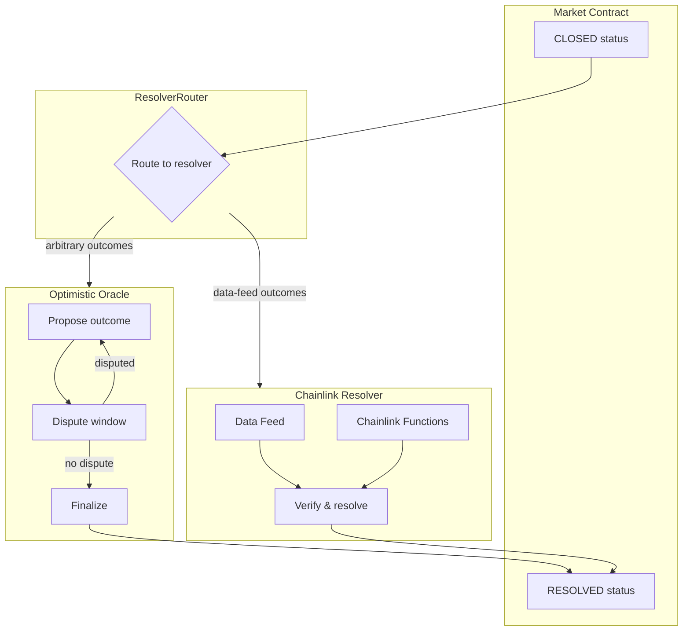

### 9.2 Optimistic Oracle Resolver

For arbitrary event outcomes (sports, politics, etc.)

```solidity
interface IOptimisticResolver {
    struct Proposal {
        bytes32 marketId;
        uint8 proposedOutcome;
        address proposer;
        uint256 proposedAt;
        uint256 bond;
        bool disputed;
        bool finalized;
    }

    function propose(bytes32 marketId, uint8 outcome) external payable;
    function dispute(bytes32 marketId) external payable;
    function finalize(bytes32 marketId) external;

    // View
    function getProposal(bytes32 marketId) external view returns (Proposal memory);
    function disputeWindow() external view returns (uint256);
    function bondAmount() external view returns (uint256);
}
```

**Parameters**:
| Parameter | Value | Notes |
|-----------|-------|-------|
| Dispute window | 24-48 hours | Configurable per market type |
| Proposer bond | 100-1000 USDC | Lost if disputed and wrong |
| Disputer bond | Same as proposer | Lost if dispute fails |

### 9.3 Chainlink Resolver

For data-driven outcomes (price targets, scores, etc.)

```solidity
interface IChainlinkResolver {
    function resolve(
        bytes32 marketId,
        address feedAddress,
        bytes32 conditionHash  // e.g., keccak256("BTC > 100000")
    ) external;

    function resolveWithFunctions(
        bytes32 marketId,
        bytes calldata request,
        bytes32 expectedHash
    ) external;
}
```

### 9.4 Resolution Flow Diagram

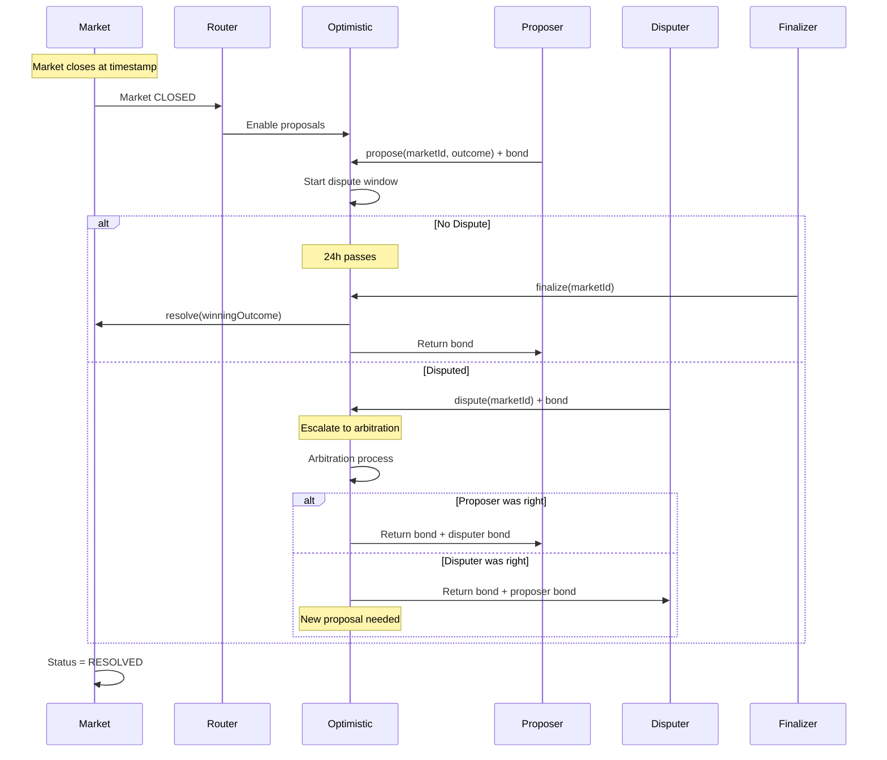

### 9.5 Mapping to Current ResolutionSource

| Old System | New System |
|------------|------------|
| `ResolutionSource.INTERNAL` | Optimistic Oracle |
| `ResolutionSource.EXTERNAL` | Chainlink Resolver |
| `ResolutionSource.HYBRID` | Either, based on data availability |
| `ResolutionDataPoint` | On-chain resolution event + metadata CID |
| Admin verification | Proposer/disputer mechanism |

---

## 10. Indexing & Data Infrastructure

### 10.1 Indexing Strategy Overview

| Layer | Purpose | Latency | Decentralized |
|-------|---------|---------|---------------|
| The Graph Subgraph | Canonical data source | ~2-10s | Yes |
| Alchemy Webhooks | Real-time notifications | <1s | No |
| Persistent Queue | Event processing | <1s | No |
| Read Cache | API responses | <100ms | No |

### 10.2 Subgraph Schema

```graphql
type Market @entity {
  id: ID!
  marketId: Bytes!
  creator: User!
  outcomeCount: Int!
  outcomeLabels: [String!]!
  status: MarketStatus!
  closesAt: BigInt!
  resolvedAt: BigInt
  resolvedOutcome: Int
  feeBps: Int!
  creatorFeeBps: Int!
  totalVolume: BigDecimal!
  reserves: [BigDecimal!]!
  prices: [BigDecimal!]!
  createdAt: BigInt!
  trades: [Trade!]! @derivedFrom(field: "market")
  positions: [Position!]! @derivedFrom(field: "market")
}

type Trade @entity {
  id: ID!
  market: Market!
  trader: User!
  outcomeIndex: Int!
  isBuy: Boolean!
  usdcAmount: BigDecimal!
  shares: BigDecimal!
  avgPrice: BigDecimal!
  timestamp: BigInt!
  txHash: Bytes!
}

type Position @entity {
  id: ID!
  user: User!
  market: Market!
  outcomeIndex: Int!
  shares: BigDecimal!
  avgCost: BigDecimal!
  realizedPnL: BigDecimal!
}

type User @entity {
  id: ID!
  address: Bytes!
  totalVolume: BigDecimal!
  totalPnL: BigDecimal!
  marketsTraded: Int!
  positions: [Position!]! @derivedFrom(field: "user")
  trades: [Trade!]! @derivedFrom(field: "trader")
}

type PriceCandle @entity {
  id: ID!
  market: Market!
  outcomeIndex: Int!
  interval: Int!  # 60, 300, 3600, 86400
  timestamp: BigInt!
  open: BigDecimal!
  high: BigDecimal!
  low: BigDecimal!
  close: BigDecimal!
  volume: BigDecimal!
}
```

### 10.3 Indexing Flow

```mermaid
flowchart TB
    subgraph Contracts[Arbitrum Contracts]
        Events[Contract Events]
    end

    subgraph Graph[The Graph Network]
        Indexer[Graph Indexer]
        Store[Graph Store]
        Query[GraphQL API]
    end

    subgraph Operational[Operational Stack]
        Webhook[Alchemy Webhook]
        Queue[Redis/BullMQ Queue]
        Processor[Event Processor]
        Cache[(PostgreSQL Cache)]
    end

    subgraph Frontend[Frontend]
        UI[Next.js App]
    end

    Events -->|index| Indexer
    Indexer --> Store
    Store --> Query
    Query --> UI

    Events -->|webhook| Webhook
    Webhook --> Queue
    Queue --> Processor
    Processor --> Cache
    Cache --> UI

    Note over Graph: Canonical, decentralized
    Note over Operational: Low-latency fallback
```

### 10.4 Webhook + Queue Architecture

**Event Flow**:
1. Contract emits event
2. Alchemy webhook fires within ~500ms
3. Webhook handler validates + enqueues
4. BullMQ worker processes idempotently
5. Updates PostgreSQL cache
6. Frontend queries cache for low-latency reads

**Backfill Strategy**:
```typescript
interface BackfillConfig {
  fromBlock: number;
  toBlock: number;
  batchSize: number;  // e.g., 1000 blocks
  contracts: string[];
  eventSignatures: string[];
}

async function backfill(config: BackfillConfig) {
  for (let start = config.fromBlock; start < config.toBlock; start += config.batchSize) {
    const logs = await provider.getLogs({
      fromBlock: start,
      toBlock: Math.min(start + config.batchSize, config.toBlock),
      address: config.contracts,
      topics: [config.eventSignatures],
    });

    for (const log of logs) {
      await processEventIdempotently(log);
    }
  }
}
```

**Reorg Handling**:
- Track `blockNumber` and `blockHash` for each event
- On reorg notification, invalidate events from orphaned blocks
- Re-process events from new canonical chain

### 10.5 Queue Selection Criteria

| Option | Pros | Cons | Recommendation |
|--------|------|------|----------------|
| **Redis Streams / BullMQ** | Fast, simple, good DX | Single point of failure | Best for MVP |
| **RabbitMQ** | Durable, proven | More complex ops | Good for scale |
| **AWS SQS** | Managed, scalable | Vendor lock-in, latency | If on AWS |
| **Kafka** | High throughput | Overkill for this scale | Not recommended |

**Recommendation**: Start with BullMQ (Redis-based), migrate to RabbitMQ if needed.

---

## 11. Admin Workflow Adaptation

### 11.1 Admin Actions Mapping

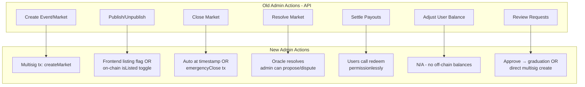

### 11.2 Admin UI Changes

| Feature | Old Implementation | New Implementation |
|---------|-------------------|-------------------|
| Event/Market creation | Form → API → DB | Form → tx builder → multisig submit |
| Market status | DB field toggle | Read from contract + tx for changes |
| User balances | DB query | Subgraph query (USDC + positions) |
| Bet history | DB query | Subgraph query (Trade events) |
| Resolution | Admin clicks "Resolve" | Admin proposes via oracle UI |
| Audit log | `AdminActionLog` table | On-chain events + off-chain UI logs |

### 11.3 Governance Structure

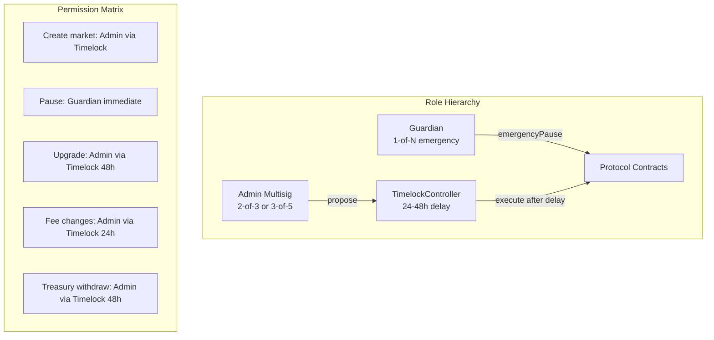

### 11.4 Market Request Flow (New)

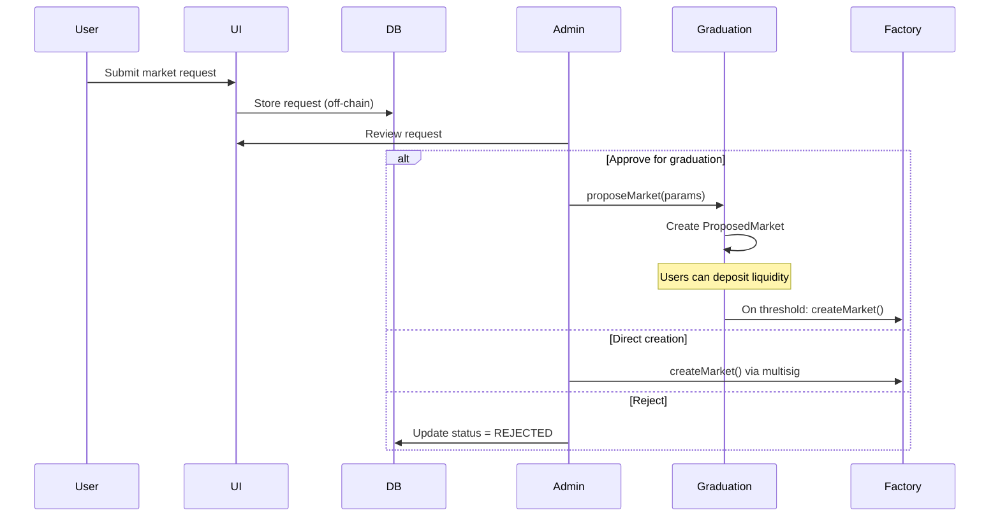

---

## 12. Security Requirements

### 12.1 Threat Model

| Threat | Impact | Mitigation |
|--------|--------|------------|
| **Reentrancy** | Fund theft | CEI pattern, ReentrancyGuard |
| **Integer overflow** | Incorrect calculations | Solidity 0.8+, SafeMath implicit |
| **Price manipulation** | Unfair trades | Slippage protection, TWAP if needed |
| **Oracle manipulation** | Wrong resolution | Dispute mechanism, bond economics |
| **Signature replay** | Double execution | Nonce tracking, expiry |
| **MEV/Sandwiching** | Value extraction | Slippage bounds, private mempools |
| **Upgrade attack** | Contract takeover | Timelock, multisig, no selfdestruct |
| **Flash loan attack** | Price/oracle manipulation | Block-based delays, TWAP |

### 12.2 Smart Contract Security

**Required Practices**:
- [ ] Formal verification of CPMM invariant
- [ ] Multiple independent audits (2+)
- [ ] Bug bounty program (Immunefi)
- [ ] Comprehensive test coverage (>95%)
- [ ] Fuzzing with Foundry/Echidna
- [ ] Slither/Mythril static analysis

**Access Control**:
```solidity
// Role-based access
bytes32 public constant ADMIN_ROLE = keccak256("ADMIN_ROLE");
bytes32 public constant GUARDIAN_ROLE = keccak256("GUARDIAN_ROLE");
bytes32 public constant RESOLVER_ROLE = keccak256("RESOLVER_ROLE");

// Timelock for sensitive operations
modifier onlyTimelock() {
    require(msg.sender == timelock, "Only timelock");
    _;
}
```

### 12.3 Upgradeability Security

**UUPS Proxy Pattern**:
- Upgrade logic in implementation, not proxy
- Storage layout must be append-only
- `_authorizeUpgrade` restricted to timelock

**Upgrade Process**:
1. Deploy new implementation
2. Propose upgrade via multisig
3. 48-hour timelock delay
4. Community review period
5. Execute upgrade

**Emergency Procedures**:
- Guardian can pause without timelock
- Pause halts all trading, not withdrawals
- Unpause requires full governance process

### 12.4 Observability

**On-Chain Events** (all operations emit events):
- Trade, LiquidityAdded, LiquidityRemoved
- MarketCreated, StatusChanged, Resolved
- OrderFilled, OrderCancelled
- Paused, Unpaused, Upgraded

**Off-Chain Monitoring**:
- Subgraph indexer health alerts
- Anomaly detection (unusual volume, prices)
- Reorg detection and alerting
- Contract balance monitoring

---

## 13. Migration Plan

### 13.1 Phased Rollout

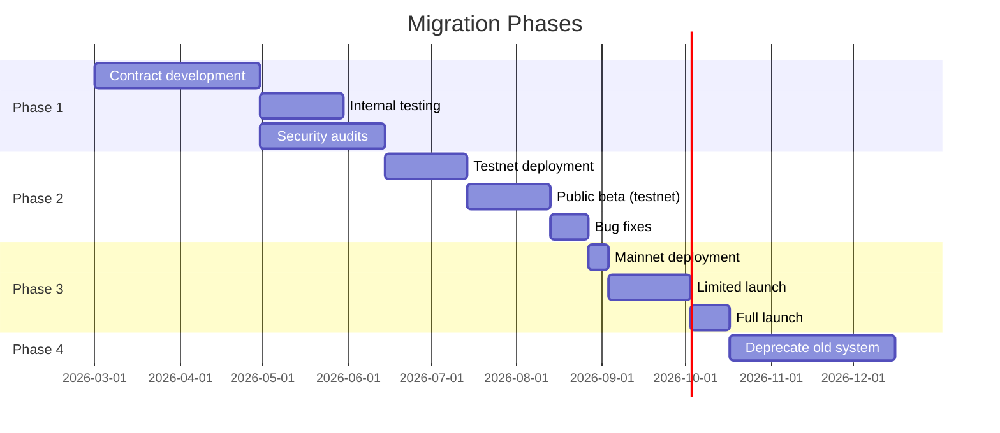

### 13.2 Data Migration

**What migrates**:
- User identities (wallet linking)
- Historical trade data (for display only)
- Market metadata (to IPFS)

**What doesn't migrate**:
- Off-chain balances (users deposit fresh USDC)
- Positions (old markets settle first)
- XP/gamification (redesign for on-chain)

### 13.3 Backward Compatibility

**During transition**:
- Old system continues for existing markets
- New markets created on-chain only
- Users can use both systems with same wallet
- Unified UI shows both

**Post-transition**:
- Old system read-only
- Historical data preserved
- No new off-chain markets

### 13.4 Rollback Plan

**Triggers**:
- Critical vulnerability discovered
- Unacceptable UX issues
- Regulatory concerns

**Process**:
1. Pause new market creation on-chain
2. Allow existing positions to settle
3. Restore off-chain system for new markets
4. Communicate clearly to users

---

## Appendix A: Contract Interfaces (Full)

See separate file: `contracts/interfaces/` (to be created during implementation)

## Appendix B: Subgraph Mappings (Full)

See separate file: `subgraph/mappings/` (to be created during implementation)

## Appendix C: API Changes Summary

| Old Endpoint | New Equivalent |
|--------------|---------------|
| `POST /api/trades/buy` | Contract: `market.buy()` |
| `POST /api/trades/sell` | Contract: `market.sell()` |
| `GET /api/quote` | Contract: `market.getQuote()` |
| `GET /api/me` | Subgraph: user entity |
| `GET /api/position/[id]` | Subgraph: position entity |
| `POST /api/me/redeem` | Contract: `market.redeem()` |
| `GET /api/events` | Subgraph: markets query |
| `POST /api/admin/markets` | Contract: `factory.createMarket()` |
| `POST /api/admin/markets/[id]/resolve` | Contract: `resolver.propose()` |

## Appendix D: Implementation Timeline (3 Devs in Parallel, 10x AI-Assisted)

> **Assumptions**: 
> - 3 developers working in parallel with AI pair programming (Cursor, Copilot)
> - **Existing UI/UX is 90%+ done** — minimal wiring to contracts
> - Modern tooling (Foundry, wagmi/viem, The Graph)
> - Audit booked in advance, starts end of Week 2
> - MVP scope for v1 (defer advanced features post-launch)

### Executive Summary

| Category | Hours | Budget | Notes |
|----------|-------|--------|-------|
| **Core Development** | 165h | $18,000 - $20,000 | Contracts, backend, frontend |
| **Flex Hours** | 45h | ~$5,000 | Maintenance, unknowns, exploration |
| **Total Development** | **210h** | **$23,000 - $25,000** | |

### Budget Breakdown

```
┌─────────────────────────────────────────────────────────────┐
│                    DEVELOPMENT BUDGET                        │
├─────────────────────────────────────────────────────────────┤
│  CORE WORK                                    165h  ~$18-20k │
│  ├── Contracts (Dev 1)                         90h           │
│  ├── Backend (Dev 2)                           38h           │
│  └── Frontend (Dev 3)                          37h           │
├─────────────────────────────────────────────────────────────┤
│  FLEX HOURS                                    45h   ~$5k    │
│  ├── General Maintenance                       20h           │
│  ├── Padding / Unknown Unknowns                15h           │
│  └── Exploratory / R&D                         10h           │
├─────────────────────────────────────────────────────────────┤
│  TOTAL                                        210h  ~$23-25k │
└─────────────────────────────────────────────────────────────┘
```

### Team Structure & Parallel Workstreams

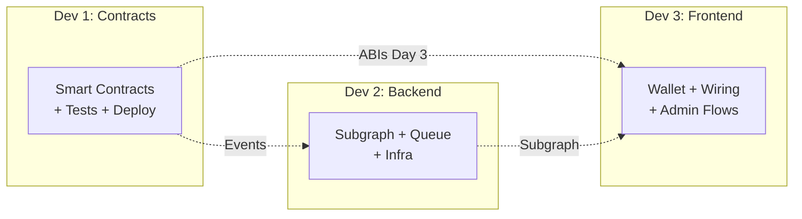

| Developer | Primary Focus | Core Hours | Flex Hours | Total |
|-----------|--------------|------------|------------|-------|
| **Dev 1** | Contracts, tests, audit | 90h | 15h | **105h** |
| **Dev 2** | Subgraph, queue, infra | 38h | 15h | **53h** |
| **Dev 3** | Wallet, wiring, admin | 37h | 15h | **52h** |
| **Total** | | **165h** | **45h** | **210h** |

---

### Sprint 1: Dev Complete → Testnet (Weeks 1-2) — 100h Core

**Goal**: Core contracts + integration working, testnet deployed, audit submitted

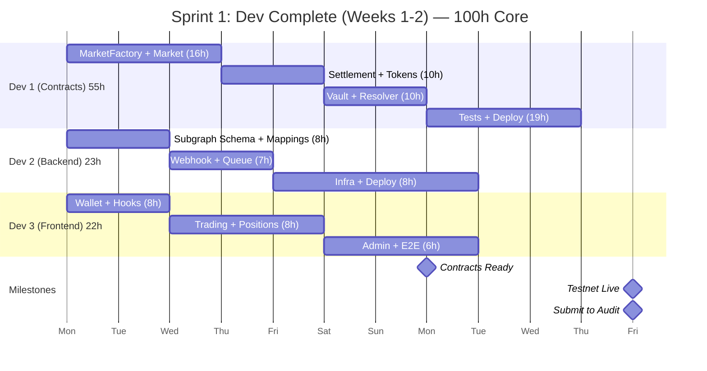

#### Sprint 1 Core Task Breakdown (100h)

**Dev 1 — Contracts (55h)** — *Unchanged, this is the critical path*

| Task | Hours | Notes |
|------|-------|-------|
| MarketFactory (UUPS) | 5h | Proxy, create, registry |
| Market Contract | 11h | Multi-outcome CPMM, state machine |
| OutcomeToken (ERC-1155) | 3h | Mint/burn access control |
| OrderSettlement | 8h | EIP-712, fills, nonces |
| LiquidityVault | 5h | Deposit/withdraw (MVP) |
| ResolverRouter | 5h | Optimistic adapter (Chainlink v2) |
| Unit + Fuzz Tests | 12h | Foundry, critical paths |
| Testnet Deployment | 4h | Arbitrum Sepolia, verify |
| Audit Prep (NatSpec) | 2h | Comments for auditors |
| **Subtotal** | **55h** | |

**Dev 2 — Backend/Infra (23h)** — *Lean, AI-assisted*

| Task | Hours | Notes |
|------|-------|-------|
| Subgraph Schema + Mappings | 5h | AI generates boilerplate |
| Subgraph Tests | 1h | Smoke tests only |
| Webhook + Queue | 5h | Alchemy + BullMQ basics |
| Event Processor | 4h | Idempotent handlers |
| Testnet Infra | 4h | Redis, env config |
| Deploy + Basic Docs | 4h | Studio + essentials |
| **Subtotal** | **23h** | |

**Dev 3 — Frontend (22h)** — *Wiring only, UI exists*

| Task | Hours | Notes |
|------|-------|-------|
| Wallet Integration | 4h | wagmi connect (pattern exists) |
| Contract Hooks | 4h | useMarket, useTrade, useRedeem |
| Trading Panel Wiring | 4h | Swap API → contract calls |
| Position + Redeem Wiring | 4h | Swap API → subgraph |
| Admin TX Flows | 4h | Market create, resolve buttons |
| Basic E2E | 2h | Happy path only |
| **Subtotal** | **22h** | |

---

### Sprint 2-3: Iterate, Audit Response & Launch (Weeks 3-6) — 65h Core

**Goal**: Fix testnet bugs, respond to UX/audit feedback, deploy mainnet

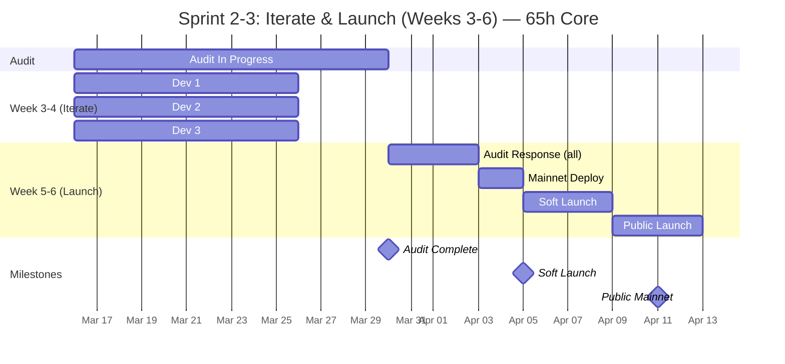

#### Sprint 2-3 Core Task Breakdown (65h)

**Dev 1 — Contracts (35h)**

| Task | Hours | Notes |
|------|-------|-------|
| Testnet Bug Fixes | 6h | Issues from testing |
| Gas Optimizations | 4h | Quick wins |
| Static Analysis | 3h | Slither warnings |
| Audit Response | 12h | Fix findings |
| Mainnet Deploy | 6h | Deploy, verify, configure |
| Bug Bounty Triage | 4h | Initial reports |
| **Subtotal** | **35h** | |

**Dev 2 — Backend (15h)**

| Task | Hours | Notes |
|------|-------|-------|
| Indexer Bug Fixes | 3h | Sync issues |
| Mainnet Infra | 6h | Production setup |
| Monitoring Polish | 3h | Basic alerts |
| Subgraph Mainnet | 3h | The Graph Network |
| **Subtotal** | **15h** | |

**Dev 3 — Frontend (15h)**

| Task | Hours | Notes |
|------|-------|-------|
| UX Feedback Fixes | 6h | Critical feedback only |
| Error Handling | 3h | User-friendly errors |
| Mobile Fixes | 3h | Wallet issues |
| Launch Support | 3h | On-call |
| **Subtotal** | **15h** | |

---

### Flex Hours Pool (45h) — $5k Reserved

Flex hours are **not pre-allocated** to specific tasks. Draw from this pool as needed.

| Category | Hours | Use Cases |
|----------|-------|-----------|
| **General Maintenance** | 20h | Dependency updates, security patches, CI/CD fixes, env issues |
| **Padding / Unknowns** | 15h | Audit surprises, integration edge cases, testnet weirdness |
| **Exploratory / R&D** | 10h | Gas optimization research, alternative approaches, tooling |

**Rules for flex hours:**
- Track separately from core hours
- Requires brief justification when used
- Unused hours roll into post-launch maintenance
- Can be reallocated between devs as needed

---

### Full Timeline Visualization

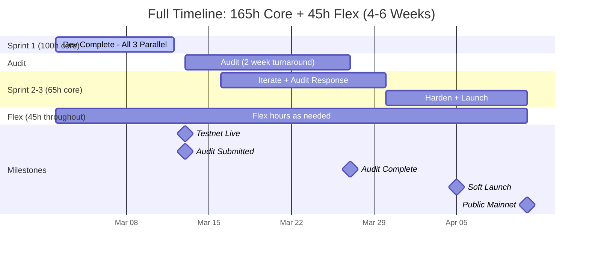

### Hour Distribution Summary

```
                        Dev 1    Dev 2    Dev 3    Total
                       ───────  ───────  ───────  ───────
Sprint 1 Core            55h      23h      22h     100h
Sprint 2-3 Core          35h      15h      15h      65h
                       ───────  ───────  ───────  ───────
Core Subtotal            90h      38h      37h     165h
Flex Pool (shared)                                  45h
                       ───────────────────────────────────
Grand Total                                        210h
```

### Timeline Scenarios

| Scenario | Duration | Notes |
|----------|----------|-------|
| **Aggressive** | 4 weeks | Clean audit, minimal flex usage |
| **Expected** | 5 weeks | Normal audit findings, ~30h flex used |
| **Conservative** | 6 weeks | Full flex pool consumed |

### Cost Estimate

| Category | Hours | Cost | Notes |
|----------|-------|------|-------|
| **Core Development** | 165h | $18,000 - $20,000 | @ ~$110-120/hr avg |
| **Flex Hours** | 45h | ~$5,000 | @ ~$110/hr |
| **Total Development** | **210h** | **$23,000 - $25,000** | |

| Other Costs | Estimate | Notes |
|-------------|----------|-------|
| **Audit** | $25,000 - $50,000 | Fast-track single audit |
| **Infrastructure** | $1,000 setup + $500/mo | Alchemy, The Graph, Redis |
| **Bug Bounty Fund** | $10,000 - $25,000 | Immunefi pool |
| **Total Launch** | **$59,000 - $105,000** | |

### Critical Path

```
Week 1-2: All 3 devs build in parallel
    ↓
Week 2 end: Testnet live, audit submitted ← KEY MILESTONE
    ↓
Week 3-4: Iterate while audit runs (not blocked)
    ↓
Week 4 end: Audit results received
    ↓
Week 5: Fix audit findings + deploy mainnet
    ↓
Week 5-6: Soft launch → Public launch
```

**The audit is the only true blocker** — all other work happens in parallel.

### Risk Mitigation

| Risk | Mitigation |
|------|------------|
| Audit delays | Book NOW; have backup auditor lined up |
| Critical findings | 14h budgeted for audit response |
| UX feedback overload | Timebox to 14h; defer non-critical to post-launch |
| Testnet issues | 3 devs can swarm any blocker |
| Launch day issues | All hands on deck, feature flags ready |

### Pre-Sprint Checklist

- [ ] Audit booked (2-week turnaround confirmed)
- [ ] Arbitrum Sepolia ETH funded
- [ ] Testnet USDC available
- [ ] Alchemy account + API keys
- [ ] The Graph Studio account
- [ ] Redis instance provisioned
- [ ] Safe multisig created (testnet)
- [ ] Bug bounty scope drafted

---

*This document is the authoritative requirements specification for the on-chain migration. Implementation should follow this spec, with deviations documented and approved.*
